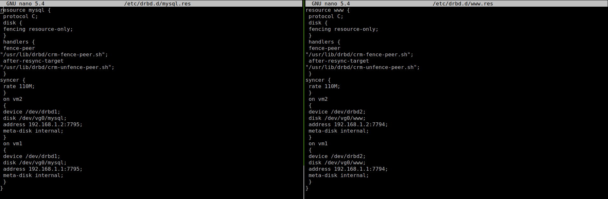
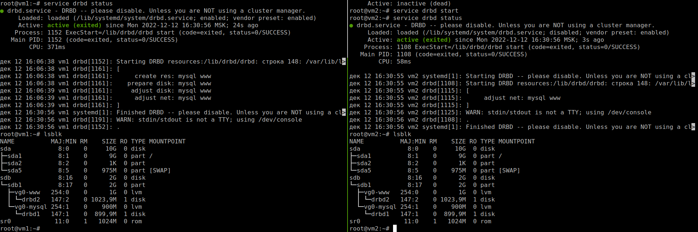

# Домашнее задание к занятию "`10.3 Pacemaker`" - `Живарев Игорь`

### Задание 1

`Pacemaker - менеджер ресурсов кластера(Cluster Resource Manager). Его главная задача - достижение максимальной доступности управляемых им ресурсов и защита их от сбоев как на уровне самих ресурсов, так и на уровне целых узлов кластера. Архитектура pacemaker состоит из трех уровней:`

1. `Кластеронезависимый уровень - на этом уровне располагаются сами ресурсы и их скрипты, которыми они управляются и локальный демон, который скрывает от других уровней различия в стандартах, использованных в скриптах (на рисунке зеленый).`
2. `Менеджер ресурсов(Pacemaker), который предстовляет из себя «мозг». Он регирует на события происходящие в кластере: отказ или присоединение узлов, ресурсов, переход узлов в сервисный режим и другие административные действия. Pacemaker исходя из сложившейся ситуации делает рассчет наиболее оптимального состояния кластера и дает команды на выполнения действий для достижения этого состояния(остановка/перенос ресурсов или узлов). На рисунке обозначен синим.`
3. `Информационный уровень - на этом уровне осуществляется сетевое взаимодействие узлов, т.е. передача сервисных команд(запуск/остановка ресурсов, узлов и т.д.), обмен информацией о полноте состава кластера(quorum)и т.д.`

### Задание 2

`Corosync — программный продукт, позволяющий реализовать кластер серверов. Его основное назначение — знать и передавать состояние всех участников кластера.`
`В основе работы заложены следующие функции:`

1. `Отслеживание состояния приложений.`
2. `Оповещение приложений о смене активной ноды кластера.`
3. `Отправка одинаковых сообщений процессам на всех узлах кластера.`
4. `Предоставление доступа к базе данных с конфигурацией и статистикой, а также отправка уведомлений о ее изменениях.`
5. `Заполните здесь этапы выполнения, если требуется ....`

### Задание 3

